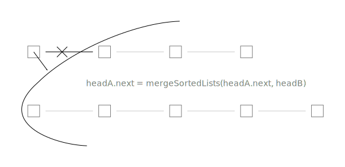
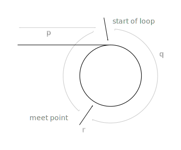


# Contents
{:.no_toc}


* this line is replaced with the generated table of contents
{:toc}

# Linked lists

``` python
class Node(object):
   def __init__(self, data=None, next_node=None):
       self.data = data
       self.next = next_node
```

``` python
def MergeSortedLists(headA, headB):
    if not headA: return headB
    if not headB: return headA
    
    if headA.data < headB.data:
        headA.next = MergeLists(headA.next, headB)
        return headA
    else:
        headB.next = MergeLists(headA, headB.next)
        return headB
```



``` python
def MergeLists(headA, headB):
    if not headA: return headB
    if not headB: return headA

    if not (headA.data < headB.data):
        headA, headB = headB, headA

    result = headA
        
    while headA.next:
        if headB.data < headA.next.data:
            headA.next, headB = headB, headA.next
        headA = headA.next
 
    headA.next = headB
    return result
```


``` python
# the code assumes the node at position exists
def GetNodeFromEnd(head, position):
    result  = head
    current = head
    i = 0
    
    while current.next:
        i += 1
        current = current.next
        if i > position:
            result = result.next
```

``` python
def RecursiveGetNodeFromEnd(head, position):
    if not head:
        return (None, 0)
    
    (r, i) = RecursiveGetNode(head.next, position)
    if i == position:
        return (head.data, i+1)
    else:
        return (r, i+1)

def GetNodeFromEnd(head, position):
    (r, _) = RecursiveGetNode(head, position)
    return r
```

``` python
def RemoveDuplicates(head):
    if not head:
        return None

    current = head
    
    while current.next:
        if current.data == current.next.data:
            current.next = current.next.next
        else:
            current = current.next
  
    return head
```

detecting a loop in a linked list:
<http://blog.ostermiller.org/find-loop-singly-linked-list>
<http://k2code.blogspot.ru/2010/04/how-would-you-detect-loop-in-linked.html>

``` python
def has_cycle(head):
    if not head or not head.next:
        return False
    
    current = head
    prev = None
    
    while current.next:
        current.next, next, prev = prev, current.next, current
        
    return current is head
```

``` python
def has_cycle(head):
    if not head:
        return False
    
    tortoise = hare = head
    
    while hare.next and hare.next.next:
        tortoise = tortoise.next
        hare = hare.next.next
        if tortoise is hare:
            return True

    return False
```

{: .centered}


``` python
def has_cycle(head):
    if not head:
        return False
    
    tortoise = hare = head
    teleport = 2
    steps = 0
    
    while hare.next:
        steps +=1
        hare = hare.next
        if tortoise is hare:
            return True
        
        if steps == teleport:
            steps = 0
            teleport *= 2
            tortoise = hare

    return False
```

<div class="ryctoic-questions" markdown="1">
deck:
algorithms and data structures --- linked lists

- q: Write a class for a node of a linked list. --- a: copied from context
- q: Merge two sorted linked lists recursively. --- a: copied from context
- q: Merge two sorted linked lists iteratively. --- a: copied from context
- q: Get nth node from the end of a linked list iteratively. --- a: copied from context
- q: Get nth node from the end of a linked list recursively. --- a: copied from context
- q: Delete duplicates from sorted linked list.
- q: What are the ways to detect a loop in a linked list? --- a: Reverse the list, tortoise and hare, and the optimized version, teleporting tortoise.
- q: Detect a loop in a linked list using reverse.
- q: Detect a loop in a linked list using tortoise and hare algorithm.
- q: Detect a loop in a linked list using teleporting tortoise algorithm.

- q: When detecting a loop in a linked list using the tortoise and hare algorithm, where do they meet? --- a: TODO: proof they meet, and they meet at beginning of the loop: <http://stackoverflow.com/questions/2936213/explain-how-finding-cycle-start-node-in-cycle-linked-list-work>
- q: Pollard's rho algorithm for integer factorization. <https://en.wikipedia.org/wiki/Pollard%27s_rho_algorithm>, <https://www.cs.colorado.edu/~srirams/courses/csci2824-spr14/pollardsRho.html> 

TODO:


- q: print elements of a linked list
- q: insert a node at the head of a linked list, return new head
- q: insert a node at the end of a linked list, return the head
- q: insert a node at given position of a linked list, return the head
- q: remove a node at given position of a linked list, return the head
- q: print a linked list in reverse order
- q: compare two linked lists
</div>

TODO: python doesn't have tail recursion. How to work with linked lists? 


# Trie

derived from the word "re*trie*val" and pronounced as "try" to distinguish from "tree"

keys are words, alphabet of size \\(A\\)
number of words in the trie is \\(N\\)

functions:

- insert a key, value
- retrieve a value by key
- delete a key --- lazy without clean up, eager with clean up

\\(\Theta(l)\\), where \\(l\\) is a word length, search miss \\(O(\log_A{N})\\) --- <http://algs4.cs.princeton.edu/lectures/52Tries.pdf#21>

- get number of keys in trie --- lazy dts, eager with number for the whole trie, very eager with numbers for nodes


- get all words with a prefix
- wildcard match
- longest word, which is a prefix of a given one


when you have anything to do with prefixes, alphabetical ordering
also easy to implement, no hash functions, resizing, rehashing

can be slower and require more space than a hash table, depends on data

number of pointers is between RN and RNw, where w is an average word length

application:

- dictionary kv-storage
- spellchecker, t9, word games
- wildcard searching
- sorting
- ip routing (longest prefix matching)
- full text search
- data compression
- computational biology
- storing and queryng xml

<http://algs4.cs.princeton.edu/52trie/>
<https://leetcode.com/articles/implement-trie-prefix-tree/>
<http://phpir.com/tries-and-wildcards/>
Skiena
<https://en.wikipedia.org/wiki/Trie#As_a_replacement_for_other_data_structures>
https://www.toptal.com/java/the-trie-a-neglected-data-structure#performance-tests

http://algs4.cs.princeton.edu/lectures/52Tries.pdf
http://www.cs.princeton.edu/courses/archive/fall05/cos226/lectures/trie.pdf

exercises:
<https://leetcode.com/problems/implement-trie-prefix-tree/>
<https://www.topcoder.com/community/data-science/data-science-tutorials/using-tries/>
<http://www.spoj.com/problems/PHONELST/>
<https://www.codechef.com/problems/EST>
<https://threads-iiith.quora.com/Tutorial-on-Trie-and-example-problems>
<https://www.hackerrank.com/challenges/contacts>
<https://www.hackerrank.com/challenges/no-prefix-set>


<div class="ryctoic-questions" markdown="1">
- why is it called trie?
- trie vs hash table and other search trees
- functions on trie and their implementations
- implementation of nodes
- time-space complexity
- applications
- what about to have hash tables or other data structures instead of arrays in trie nodes?
</div>


<div class="todo" markdown="1">
- TODO: illustraton of trie nodes implementation: <http://127.0.0.1:4001/algorithms/Algorithms.4th.by_Sedgewick_Wayne.pdf#747>
- TODO: search miss \\(O(\log_{A}{N})\\): <http://127.0.0.1:4001/algorithms/Algorithms.4th.by_Sedgewick_Wayne.pdf#756>
- TODO: space requirements and estimates table: <http://127.0.0.1:4001/algorithms/Algorithms.4th.by_Sedgewick_Wayne.pdf#758>
- TODO: exercises table: <http://127.0.0.1:4001/algorithms/Algorithms.4th.by_Sedgewick_Wayne.pdf#767>
- TODO: add exersices
- TODO: add comparements with other algorithms
- TODO: succinct trie --- <http://stevehanov.ca/blog/index.php?id=120>, [Succinct Trees in Practice](http://epubs.siam.org/doi/abs/10.1137/1.9781611972900.9)
- TODO: what is double-array trie? <https://linux.thai.net/~thep/datrie/datrie.html>
- TODO: directed acyclic word graph (aka dawg)
- TODO: radix tree
- TODO: fix wikipedia article on tries --- wrong complexity or memory
</div>

# Ternary search tree

when nodes have most children pointers used, trie is more space and time efficient than the TST

good for large alphabets, ascii, unicode --- tries won't handle this

TODO: can build balanced TSTs via rotations to achieve \( L + \log N \) worst-case guarantees, but probably not worth the trouble, since they work good even without this --- <http://algs4.cs.princeton.edu/lectures/52Tries.pdf#34>
as fast as hash tables for string keys, space efficient


<div class="ryctoic" markdown="1">
- when trie is more efficient than a tst?
</div>


# Skip list

<https://en.wikipedia.org/wiki/Skip_list>

<https://www.quora.com/Why-arent-skip-lists-used-more-often-instead-of-balanced-trees/answer/Jaap-Weel?srid=Ywn4>

<http://stackoverflow.com/questions/256511/skip-list-vs-binary-tree>

<https://www.cs.auckland.ac.nz/~jmor159/PLDS210/niemann/s_cm2.htm>

<http://blog.memsql.com/the-story-behind-memsqls-skiplist-indexes/>

<http://igoro.com/archive/skip-lists-are-fascinating/>

<http://eternallyconfuzzled.com/tuts/datastructures/jsw_tut_skip.aspx>

<https://www.cs.umd.edu/class/spring2008/cmsc420/L12.SkipLists.pdf>


# misc


how to iterate over a binary tree

b-tree

https://www.quora.com/As-we-start-planning-the-next-edition-of-Introduction-to-Algorithms-CLRS-what-should-we-add-and-what-should-we-remove

dfs with explicit stack --- http://stackoverflow.com/questions/5278580/non-recursive-depth-first-search-algorithm/5278667#5278667

https://en.wikipedia.org/wiki/N-gram

invert binary tree, yes

<http://algs4.cs.princeton.edu/cheatsheet/>, <http://introcs.cs.princeton.edu/java/lectures/>

Алгоритмы и структуры данных в ядре Linux, Chromium --- https://habrahabr.ru/company/wunderfund/blog/277143/


# Trash



- {{ member.name }}, https://github.com/{{ member.github }}



{{ asdf.name }}, <https://github.com/{{ asdf.github }}>

| col 3 is      | \\(\Theta(l)\\) | $1600  |
| col 2 is      | centered        | $12    |
| zebra stripes | are neat        | $1     |
{: .mytable}


