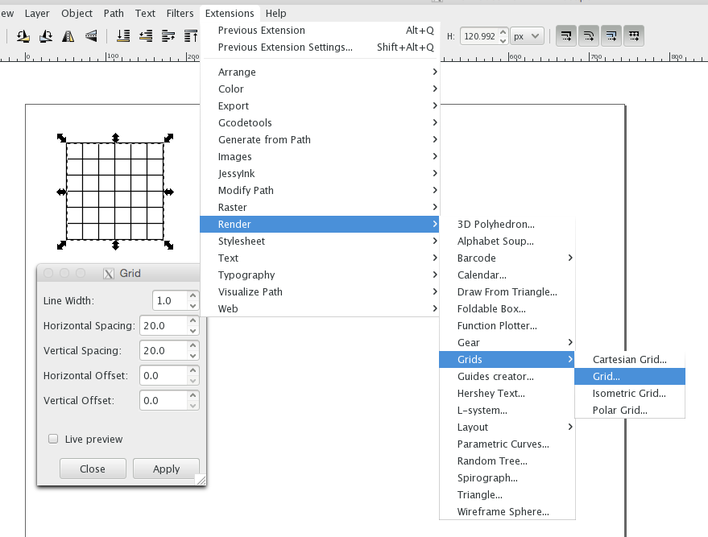

# inkscape

## grid

- q: create a grid 6x6 --- a: create a rectangle 120x120, then `extensions -> render -> grids -> grid`, set `spacing=20`

# command line

less:
`p` --- beginning of file
`G` --- end of file
`/` --- search, `n` and `N` are next and prev
