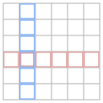

# combinatorics

\\[ \binom{N}{n} \ = \ \frac{N!}{(N-n)! \ n!} \\]

q: number of combinations
q: number of permutations

# axioms

- \\( P(\Omega) = 1 \\)
- \\( P(A) \ge 0 \\)
- \\( P(A+B) = P(A) + P(B) \\)

## sigma-additive measure example

$$
\begin{align*}
P(\{\text{outcome is even}\}) &= P( \{2\} + \{4\} + \{6\} + \ldots) = \\
&= P(\{2\}) + P(\{4\}) + P(\{6\}) + \ldots = \\
&= \frac{1}{2^2} + \frac{1}{2^4} + \frac{1}{2^6} + \ldots = \\ 
&= \frac{1}{4} \cdot (1 + \frac{1}{4} + \frac{1}{4^2} + \frac{1}{4^3} + \ldots) = \\ 
&= \frac{1}{4} \cdot \frac{1}{1-\frac{1}{4}} = \frac{1}{3}
\end{align*}
$$

TODO: more examples

- q: why do we need sigma-additiveness?

## Boole and Bonferroni inequalities

\\( P(A + B) \ \leq \ P(A) + P(B) \\)
\\( P(AB) \ \geq \ P(A) + P(B) - 1 \\)

- q: \\( P(A + B) \ \bigvee \ P(A) + P(B) \\)
- q: \\( P(AB) \ \bigvee \ P(A) + P(B) \\)

TODO: check if there are more under these names

# conditional probability

\\[ P(A \, \| \, B) \ = \ \frac{P(AB)}{P(B)} \\]

# independence

Threre are two equivalent definitions:

\\[ P(A \, \| \, B) \ = \ P(A), \  \text{ when } P(B) \neq 0 \\]

\\[ \text{or} \\]

\\[ P(AB) \ = \ P(A) \cdot P(B) \\]

The first one is more intuitive, the second one doesn't have to have a condition.

{: .centered}

- q: Definition of independence. --- a: \\( P(A \, \| \, B) \ = \ P(A) \text{, when } P(B) \neq 0 \\), or equivalent one, \\( P(AB) \ = \ P(A) \cdot P(B) \\)
- q: independence vs disjointness

